<div align="center">



</div>

---

## 👋 About

```console
~/gabbensa $ whoami

  role      : full-stack developer
  stack     : typescript · react · next.js · node · postgres · python
  focus     : multi-tenant saas · llm integrations · automation
  origin    : network administration (mcsa) → software
  status    : shipping something in stealth
  rule #1   : security is designed in, never bolted on

~/gabbensa $ _
```

Full-stack developer working across **React / Next.js / TypeScript** on the front, **Node.js, Postgres and Supabase** on the back — with a strong pull toward **LLM integrations and Workflow Automation**.

I started as a  **Network Administrator** (MCSA), which is where I picked up the habit that still shapes how I build: infrastructure and security are not a later chapter. Row-Level Security, tenant isolation and auth get designed in from day one, not bolted on when something breaks.

Mostly self-driven. I learn fast, I ship, and I keep asking dumb questions until I actually understand the thing.

---

## 🧰 Tech

**Languages**


**Front-end**


**Back-end & Data**


**AI & Automation**


**DevOps & Tools**


---

## 🚀 Projects

### 🔒 Multi-Tenant SaaS Platform · *stealth*

My main focus right now. A multi-tenant SaaS platform, built and architected solo.

`Next.js` `TypeScript` `Supabase (PostgreSQL + RLS)` `Railway`

- Multi-tenant backend architecture with **role-based access control** and strict **tenant data isolation**
- Secure API structure, auth and **Row-Level Security** enforced at the database layer
- **LLM-powered automation** integrated into the product

> Private repo — happy to walk through the architecture in a conversation.

<br />

### 📡 [Aid-Hoc](https://github.com/gabbensa/Aid-Hoc) — Emergency Messaging over WiFi Direct

Peer-to-peer messaging app for rescue units — communication with **no cellular and no internet**. Final year project, led end to end.

`Java` `Android SDK` `WiFi Direct` `Sockets`

- Automatic device discovery and socket-based communication between phones
- Real-time message sync across connected devices
- Responsive UI built with the Android SDK

<a href="https://github.com/gabbensa/Aid-Hoc">
  
</a>

<br />

### ✈️ [SpaceFly](https://github.com/gabbensa/SpaceFly) — Flight Booking System

Full-stack booking app — search, book and manage flights.

`React` `TypeScript` `Node.js` `PostgreSQL` `GitHub Actions`

- Complete front-to-back implementation
- **CI/CD pipeline** with automated testing and deployment

<a href="https://github.com/gabbensa/SpaceFly">
  
</a>

<br />

### 🤖 [AI vs Human Text Classifier](https://github.com/gabbensa/AI_vs_Human)

Text classification model separating AI-generated from human-written content — **99% accuracy** on real datasets.

`Python` `Naive Bayes` `Support Vector Classifier`

<a href="https://github.com/gabbensa/AI_vs_Human">
  
</a>

<br />

### 🧪 Also on this profile

Smaller builds and coursework — kept public because they show the range.

<a href="https://github.com/gabbensa/VehicleAgency"></a>
<a href="https://github.com/gabbensa/MyHotelManagement"></a>
<a href="https://github.com/gabbensa/QR-Code-Generator"></a>
<a href="https://github.com/gabbensa/NumericalAnalysis_Hackaton"></a>
<a href="https://github.com/gabbensa/SimonGame"></a>

---


<div align="center">

### 💬 Get in touch

Building something interesting? Let's talk.

**[bensamoungabriel@gmail.com](mailto:bensamoungabriel@gmail.com)** 

<br />


</div>
